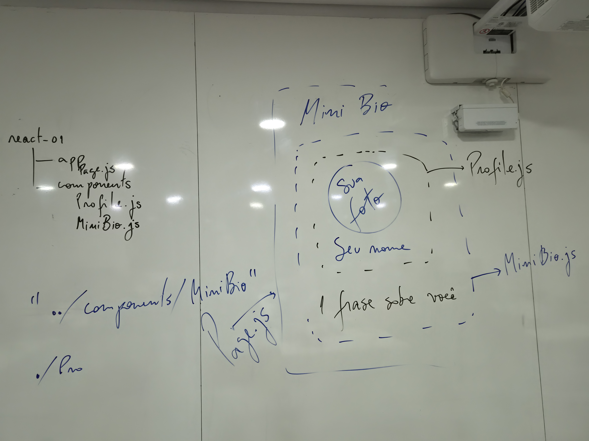
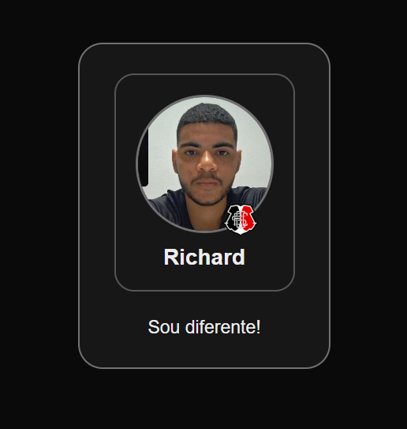

<div align="center">

  <!-- Banner Oficial UNICAP com link para o Portal -->
  <a href="https://portal.unicap.br" target="_blank" rel="noopener noreferrer">
    
  </a>

  <br/><br/>

  <h1>Desenvolvimento Front-End • 2026.2</h1>
  <p><strong>Universidade Católica de Pernambuco (UNICAP)</strong></p>

  <!-- Badges de Tecnologias, Docência e Instituição -->
  <a href="https://portal.unicap.br" target="_blank" rel="noopener noreferrer">
    
  </a>
  <a href="https://marciobueno.com/" target="_blank" rel="noopener noreferrer">
    
  </a>
  <a href="https://nextjs.org/" target="_blank" rel="noopener noreferrer">
    
  </a>
  <a href="https://react.dev/" target="_blank" rel="noopener noreferrer">
    
  </a>
  <a href="https://vercel.com/" target="_blank" rel="noopener noreferrer">
    
  </a>

  <br/><br/>

  <!-- Botão de Deploy One-Click na Vercel -->
  <a href="https://vercel.com/new/clone?repository-url=https%3A%2F%2Fgithub.com%2FRichdssz%2FFront-end-2026.2" target="_blank" rel="noopener noreferrer">
    
  </a>

</div>

---

## 📖 Sobre o Projeto

Repositório central das atividades práticas da disciplina de **Desenvolvimento Front-End** da **[Universidade Católica de Pernambuco (UNICAP)](https://portal.unicap.br)**, ministrada pelo **[Prof. Márcio Bueno](https://marciobueno.com/)** no período letivo **2026.2**.

O projeto reúne os exercícios e desafios desenvolvidos ao longo do semestre com **Next.js (App Router)** e **React 19**, enfatizando:
- Componentização declarativa, modular e reutilizável.
- Estilização moderna com CSS (Dark Mode, tipografia e layout responsivo).
- Integração contínua e deploy na nuvem com **[Vercel](https://vercel.com/)**.

---

## 🎓 Informações Acadêmicas

| Campo | Detalhes |
| :--- | :--- |
| **Instituição** | [UNICAP — Universidade Católica de Pernambuco](https://portal.unicap.br) |
| **Disciplina** | Desenvolvimento Front-End |
| **Docente** | [Prof. Márcio Bueno](https://marciobueno.com/) |
| **Período Letivo** | 2026.2 |
| **Discente** | Richard Silva ([@Richdssz](https://github.com/Richdssz)) |

---

## 📚 Tabela de Atividades do Semestre

| # | Atividade / Tema | Descrição | Componentes / Arquivos | Preview / Entrega | Status |
| :-: | :--- | :--- | :--- | :-: | :-: |
| **01** | **MiniBio & Card de Perfil** | Criação e estilização de um card de perfil com foto, insígnia sobreposta e frase de apresentação utilizando arquitetura modular em React/Next.js. | `components/Profile.js`<br/>`components/MiniBio.js`<br/>`app/page.js` | [Ver Detalhes](#-atividade-01--minibio--card-de-perfil) | Concluído |
| **02** | *Em breve* | Próxima atividade da disciplina... | — | — | ⏳ A iniciar |
| **03** | *Em breve* | Próxima atividade da disciplina... | — | — | ⏳ A iniciar |

---

## 🧩 Atividade 01 — MiniBio & Card de Perfil

### 📋 Especificação da Aula (Quadro de Aula)

<div align="center">
  
</div>

```text
react-01
├── app/
│   └── page.js          # Importa e exibe a MiniBio
└── components/
    ├── Profile.js       # Card interno: Foto de perfil + Selo + Nome
    └── MiniBio.js       # Card externo: <Profile /> + Frase personalizada
```

### 📱 Preview do Componente em Execução

<div align="center">
  <table>
    <tr>
      <td align="center" width="50%">
        <strong>Estrutura de Elementos</strong><br/><br/>
        &nbsp;&nbsp;
        <br/><br/>
        <code>components/Profile.js</code>
      </td>
      <td align="center" width="50%">
        <strong>Resultado Final Renderizado</strong><br/><br/>
        <br/><br/>
        <code>components/MiniBio.js</code>
      </td>
    </tr>
  </table>
</div>

---

## 🛠️ Tecnologias Utilizadas

- **[Next.js 16 (Turbopack)](https://nextjs.org/)** — Framework React com suporte a App Router e renderização de alta performance.
- **[React 19](https://react.dev/)** — Biblioteca para criação de interfaces baseadas em componentes.
- **[CSS Moderno](https://developer.mozilla.org/pt-BR/docs/Web/CSS)** — Estilização modular com Dark Theme e flexbox.
- **[Vercel](https://vercel.com/)** — Plataforma de deploy e hospedagem contínua (CI/CD).

---

## 🚀 Como Executar Localmente

### Pré-requisitos
- **Node.js** (versão 18+)
- **npm**, **yarn** ou **pnpm**

### Comandos:

```bash
# 1. Clone o repositório
git clone https://github.com/Richdssz/Front-end-2026.2.git

# 2. Acesse a pasta do projeto
cd Front-end-2026.2

# 3. Instale as dependências
npm install

# 4. Inicie o servidor de desenvolvimento
npm run dev
```

Abra [http://localhost:3000](http://localhost:3000) no seu navegador para visualizar.

---

## ☁️ Deploy na Vercel

O projeto está configurado para deploy imediato na **Vercel**:

1. Acesse [vercel.com](https://vercel.com/) e faça login com a conta GitHub.
2. Importe o repositório `Richdssz/Front-end-2026.2`.
3. Mantenha as configurações padrão (Framework: **Next.js**, Root Directory: `./`).
4. Clique em **Deploy**.

---

<div align="center">
  <!-- Logo Circular Oficial UNICAP com Link para o Portal -->
  <a href="https://portal.unicap.br" target="_blank" rel="noopener noreferrer">
    
  </a>
  <br/><br/>
  <p><a href="https://portal.unicap.br" target="_blank" rel="noopener noreferrer"><strong>Universidade Católica de Pernambuco (UNICAP)</strong></a> • 2026.2</p>
  <p>Desenvolvido por <a href="https://github.com/Richdssz" target="_blank" rel="noopener noreferrer"><strong>Richard Silva</strong></a> • Orientação: <a href="https://marciobueno.com/" target="_blank" rel="noopener noreferrer"><strong>Prof. Márcio Bueno</strong></a></p>
</div>
