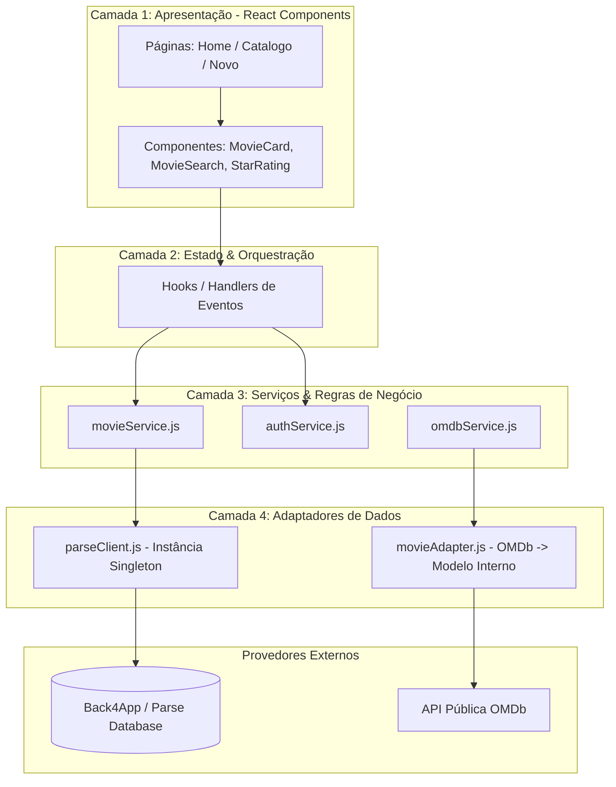

# 🏛️ Arquitetura do Sistema: CineVault (Locadora Retrô)
## Alta Coesão, Baixo Acoplamento, Princípios SOLID & Padrões GRASP

Documento de engenharia de software para o projeto de Front-End, aplicando boas práticas de arquitetura em camadas no **Next.js (React com JavaScript)** conectado ao **Back4App (BaaS)** e à **API do OMDb**.

---

## 1. Princípios de Engenharia Aplicados (SOLID & GRASP)

Como você vem de Java, POO e Spring, aplicamos aqui os mesmos fundamentos de arquitetura de software:

### 🧩 A. Princípios SOLID no Front-End

1. **S - Single Responsibility Principle (SRP / Responsabilidade Única):**
   * **Componente de UI:** Apenas renderiza dados e escuta eventos de clique/submit. Ele *não* faz chamadas HTTP e *não* formata dados complexos.
   * **Camada de Serviço (`services/`):** Apenas cuida da comunicação com APIs externas e com o banco de dados do Back4App.
   * **Adaptador (`adapters/`):** Apenas traduz o formato bruto de uma API externa para o formato que a nossa aplicação espera.

2. **O - Open/Closed Principle (OCP / Aberto para Extensão, Fechado para Modificação):**
   * Nossos componentes visuais (ex: `<MovieCard />`) recebem ações e badges por meio de propriedades (`props` e composição). Se precisarmos adicionar uma nova ação (ex: "Favoritar"), estendemos via composição sem reescrever o componente.

3. **L - Liskov Substitution Principle (LSP):**
   * Respeito estrito aos contratos de dados. Qualquer objeto que represente um `Movie` pode ser passado para a lista de filmes sem quebrar a renderização, seja ele vindo do Back4App ou de um mock de testes.

4. **I - Interface Segregation Principle (ISP):**
   * Componentes recebem apenas o que precisam. Em vez de passar um objeto gigante e monolítico com 30 atributos para um botão ou badge, passamos apenas as propriedades específicas (`status`, `rating`).

5. **D - Dependency Inversion Principle (DIP / Inversão de Dependência):**
   * As telas do Next.js **não se conectam diretamente com o Parse SDK ou com o Back4App**. Elas dependem de módulos de abstração (`movieService.js`). Se amanhã trocarmos o Back4App por Supabase, Spring Boot ou Firebase, **nenhuma tela de front-end precisará ser alterada**, apenas o arquivo de serviço.

---

### 🎯 B. Padrões GRASP (General Responsibility Assignment Software Patterns)

1. **Alta Coesão (High Cohesion):**
   * Cada pasta e módulo tem um propósito focado e bem delimitado. `authService.js` trata exclusivamente de sessão; `movieService.js` trata exclusivamente do acervo de filmes.
2. **Baixo Acoplamento (Low Coupling):**
   * A tela de catálogo não sabe se a busca veio de um banco local ou da API do OMDb; ela apenas recebe uma lista de filmes pronta para exibição.
3. **Especialista na Informação (Information Expert):**
   * Quem conhece a regra de formatação de moeda da locadora (`formatCurrency`) é o utilitário de formatação. Quem sabe como converter um objeto Parse em um JSON simples é o `movieAdapter.js`.
4. **Controlador / Controller:**
   * No Next.js App Router, as ações de interação de página ou Custom Hooks atuam como os controllers que orquestram a chamada ao serviço e atualizam o estado da tela.

---

## 2. Visão Arquitetural em Camadas



---

## 3. Estrutura de Pastas Padronizada (JavaScript)

```text
locadora-cinevault/
├── src/
│   ├── app/                      # Camada de Rotas (Next.js App Router)
│   │   ├── layout.js             # Layout raiz com fontes e Navbar global
│   │   ├── page.js               # Vitrine principal (Lista filmes do Back4App)
│   │   ├── login/page.js         # Autenticação de usuário (Parse.User.logIn)
│   │   ├── cadastro/page.js      # Criação de conta (Parse.User.signUp)
│   │   └── novo/page.js          # Formulário de cadastro de novo filme
│   │
│   ├── components/               # Camada de UI (Componentes de Apresentação)
│   │   ├── Navbar.js             # Barra superior com logo e usuário logado
│   │   ├── MovieCard.js          # Card individual (estilo Fita VHS retrô)
│   │   ├── MovieSearch.js        # Input de busca conectado à API OMDb
│   │   ├── RentalBadge.js        # Badge visual (Disponível / Alugado)
│   │   └── StarRating.js         # Avaliação por estrelas
│   │
│   ├── services/                 # Camada de Negócio / Persistência (Equivalente ao Spring @Service)
│   │   ├── parseClient.js        # Configuração Singleton do Back4App
│   │   ├── movieService.js       # Operações do acervo (salvar, listar, alterar status)
│   │   ├── authService.js        # Operações de login, logout e usuário atual
│   │   └── omdbService.js        # Requisições HTTP para a OMDb API
│   │
│   ├── adapters/                 # Camada de Adaptação (Padrão Adapter)
│   │   └── movieAdapter.js       # Converte payload da OMDb para o formato do CineVault
│   │
│   └── utils/                    # Funções utilitárias puras
│       └── formatters.js         # Formatação de datas e valores monetários
│
├── docs/                         # Documentação técnica do projeto
│   ├── ARQUITETURA_SISTEMA.md    # Este documento
│   ├── GUIA_JAVA_PARA_JAVASCRIPT.md
│   ├── PLANO_PROJETO_CRUD_FILMES.md
│   └── ROTEIRO_APRENDIZADO_LOCADORA.md
│
├── .env.local                    # Chaves de API reais (ignorado pelo git)
├── .env.example                  # Template com os nomes das variáveis
└── package.json
```

---

## 4. O Padrão Adapter na Prática (Isolamento da API Externa)

A API do OMDb retorna os dados com chaves com inicial maiúscula (`Title`, `Year`, `Poster`, `imdbID`).  
Para **não poluir** nossos componentes com o formato externo, usamos o Adapter:

```javascript
// src/adapters/movieAdapter.js
export function toMovieDomain(omdbMovie) {
  return {
    imdbId: omdbMovie.imdbID,
    title: omdbMovie.Title,
    year: omdbMovie.Year,
    genre: omdbMovie.Genre || "Não informado",
    director: omdbMovie.Director || "Não informado",
    posterUrl: omdbMovie.Poster !== "N/A" ? omdbMovie.Poster : "/placeholder-poster.png",
    plot: omdbMovie.Plot || "",
    format: "VHS",             // Padrão da locadora
    status: "available",       // Disponível para aluguel
    rentalPrice: 5.0           // Preço da diária em R$
  };
}
```

Desta forma, os componentes React só conhecem o formato limpo e padronizado do nosso domínio.

---

## 5. Próximo Passo
Com a arquitetura desenhada e alinhada a SOLID e GRASP, estamos prontos para criar a classe `Movie` no Back4App e implementar o primeiro serviço (`movieService.js`).
