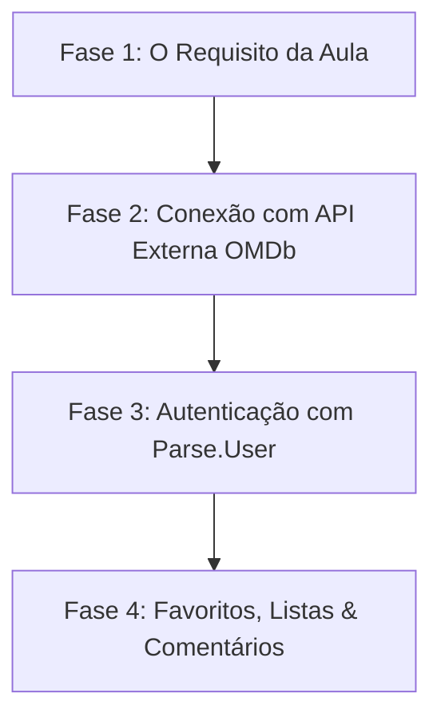

# 🎬 Plano de Aprendizado: Locadora / CineVault (Next.js + Back4App + OMDb)

> **Objetivo:** Construir um projeto robusto entendendo cada linha de código, arquitetura, modelagem e integração, sem "vibecoding" (sem colar código cego gerado por IA).

---

## 🎯 Por que isso NÃO é ambicioso demais?

O Back4App (baseado no **Parse Server**) já resolve nativamente os maiores gargalos de backend:
1. **Autenticação pronta**: Ele já tem a classe `_User` com `Parse.User.signUp()` e `Parse.User.logIn()` integrados com sessão/tokens.
2. **Relacionamentos nativos**: Ele suporta ponteiros (`Pointer`) e arrays relacionais de forma muito simples.
3. **API REST/SDK reativa**: O SDK em JavaScript cuida da persistência com poucas linhas.

---

## 🪜 Roadmap em 4 Fases (Do Básico à Maestria)

---

### 🟢 Fase 1: Entregar o Requisito do Exercício (Garantir a Nota Primeiro)
* **Objetivo:** Ter o Next.js conversando com o Back4App com 1 entidade básica.
* **O que você aprende:**
  * O que são chaves de API (`ApplicationId`, `JavaScriptKey`) e como usar variáveis de ambiente (`.env.local`).
  * Como instanciar o Parse SDK no Next.js.
  * O ciclo de vida básico: formulário -> `save()` -> `find()` -> renderizar na tela.
* **Entidade inicial:** `Movie` (Título, Diretor, Ano, Gênero, Status de Locação).

---

### 🟡 Fase 2: Integração com a API do OMDb
* **Objetivo:** Em vez de digitar tudo na mão, o usuário digita o nome do filme, e os dados vêm da internet.
* **O que você aprende:**
  * O que é um `fetch` assíncrono em JavaScript/TypeScript.
  * Como ler a documentação de uma API pública e manipular o retorno JSON.
  * Como pré-preencher o formulário ou salvar direto no Back4App com dados da API.

---

### 🟠 Fase 3: Autenticação de Usuários (Login & Cadastro)
* **Objetivo:** Cada usuário ter sua própria conta e sessão.
* **O que você aprende:**
  * Como funciona sessão e cookies/localStorage.
  * Os métodos `Parse.User.signUp(username, password)` e `Parse.User.logIn(username, password)`.
  * Como proteger páginas para que só usuários logados possam cadastrar ou comentar.

---

### 🔴 Fase 4: Listas Pessoais, Favoritos e Comentários
* **Objetivo:** Adicionar a parte social e de coleção.
* **O que você aprende:**
  * **Relacionamento 1 para N (1:N)**: Um filme tem vários comentários.
  * **Ponteiros (Pointers)** no Parse: Como atrelar um comentário ou lista ao usuário logado (`comment.set("author", currentUser)`).
  * Como filtrar no banco apenas as listas daquele usuário (`query.equalTo("user", currentUser)`).

---

## 🧭 Metodologia: Aprendizado Guiado vs "Vibecoding"

Para você **aprender de verdade** e conseguir defender o projeto na aula:
1. **Passo a passo com explicação conceitual:** A cada etapa, explicamos *por que* estamos criando aquele arquivo ou função.
2. **Você no comando:** Eu te mostro a estrutura e a lógica, e você testa, analisa os erros e valida o comportamento.
3. **Sem caixas-pretas:** Código legível, sem bibliotecas mágicas desnecessárias, usando React puro e Next.js App Router limpo.
